# NUS-Orbital-2023

##GitHub repository for NUS CP2106: Independent Software Development Project

- [1. Introduction](#introducton)
- [2. Setting Up](#setting-up)
- [3. User Stories](#user-stories)
- [4. Components](#components)
  - [4.1 Main Components](#main-components)
  - [4.2 Features](#features)
    - [4.2.1. Milestone 1](#milestone1-features)
    - [4.2.2. Milestone 2](#milestone2-features)
    - [4.2.3. Milestone 3](#milestone3-features)
- [5. Architecture](#architecture)
  - [5.1. Design Diagrams](#design-diagrams)
  - [5.2. Processes](#processes)

## 1. Introduction

**Proposed Level of Achievement:**

Project Gemini

**Aim**

LifeQuest aims to be the ultimate gamified productivity app, turning daily routines into an adventure-filled path towards achieving goals and living a more fulfilling life.

**Our Motivation**

Our motivation for developing this app stems from a personal desire to improve our own daily routine and establish better habits. We believe that many people struggle with finding the motivation and discipline to stick to their goals, and that a gamified approach can provide the necessary incentives to make positive changes.

Our personal experiences with these issues have inspired us to create an app that offers a fun, engaging, and rewarding way to tackle them. By combining game mechanics with productivity tools, our app will help users set goals, track progress, and stay focused on what matters most. We hope that by providing a comprehensive approach to productivity, our app can help users achieve their full potential and lead more fulfilling lives.

**Our Vision**

Our vision for this project is to create a leading gamified productivity app that empowers individuals to achieve their goals and live their best lives. We believe that by harnessing the power of game mechanics and social support, we can create an app that is both fun and effective in improving productivity and overall well-being.

Our app will offer a variety of features, focusing on key areas such as focus and self-improvement, we aim to provide a comprehensive solution to productivity that is both practical and engaging. We envision a future where our app is the go-to solution for individuals who want to become more productive and efficient in their daily lives. By continuously improving and updating our app based on user feedback and the latest research, we hope to stay at the forefront of the gamified productivity market and make a meaningful impact on people's lives.

## 2. Setting Up

### Setting up the project on local machine

**Prerequisites:**

- An IDE, eg. Visual Studio Code
- Python 3.7
- pip (Python package installer) available for download :https://pip.pypa.io/en/stable/installing/
- Node.js(for npm package manager) download at: https://nodejs.org/en/

**Setting up Project:**

- Clone repository from https://github.com/RyanTDL/NUS-Orbital-2023.git
- Open the project in IDE(VSCode)
- Open Terminal
- To start the **frontend** server:

  - cd into /NUS-Orbital-2023 directory

    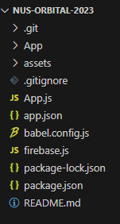

  - Run `run yarn / npm install` to install the dependencies required to run Expo Go

    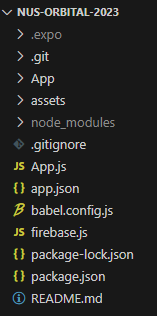

  - Run `npx expo start`
  - Once you see a QR Code, it means that it has compiled successfully and the server is active

    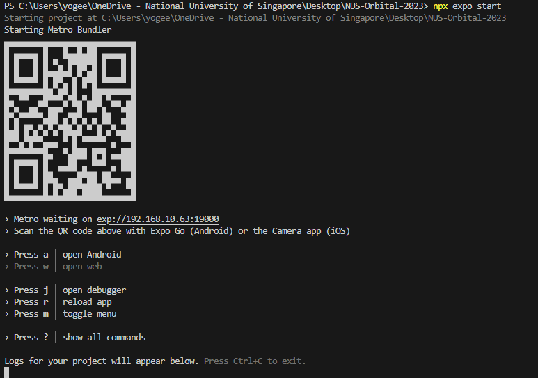

  - Install the Expo Go app on your iOS or Android phone and connect to the same wireless network as your computer. On Android, use the Expo Go app to scan the QR code from your terminal to start the app. On iOS, use the built-in QR code scanner of the default iOS Camera app.

## 3. User Stories

**Core User Stories**

1. As a student, I want to embrace a healthy lifestyle that prioritises sleep,exercise and studying, allowing me to balance my responsibilities without sacrificing my well-being.
2. As a student who lacks enthusiasm for studying, I want to be able to make completing my assignments feel more rewarding and satisfying.
3. As a student, I want to be able to keep track of my progress to ensure I am not neglecting any important elements of my personal growth and development.
4. As an unmotivated individual, I want some healthy competition that drives me to put more effort into being productive and living a balanced lifestyle.

**Extensions**

5. As an individual, who lacks the motivation to use tracking apps over a long period of time,I want to be incentivised and encouraged to use the app.
6. As a player in the game, I want to be able to personalise and customise my character/profile to enhance the overall gaming/user experience.
7. As a user who enjoys social interaction, I want to be included in a community where I can connect with like-minded individuals, share progress, and provide support and encouragement.
8. As a long-term user, I want a convenient app that can seamlessly integrate with smart devices, collecting data effortlessly as I go about my daily life.
9. As a player, seeking continuous engagement, I want to be regularly introduced to new challenges, quests, or activities to keep me motivated and invested in the app.

## 4. Components

### 4.1 Main Components

Over mobile app's frontend is made up of these main componenets:

- Welcome page
- Sign Up
- Log in

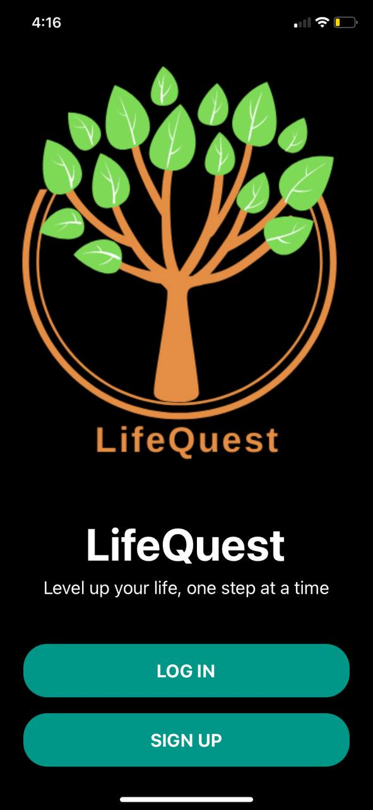
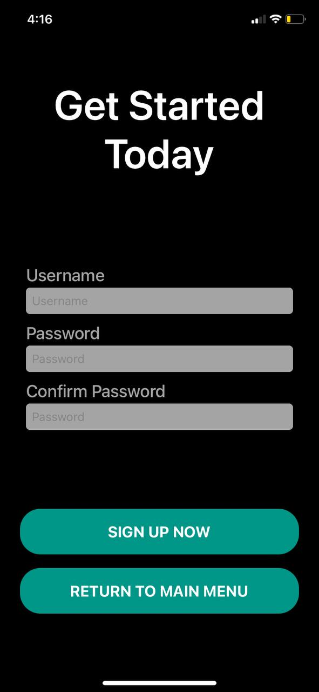
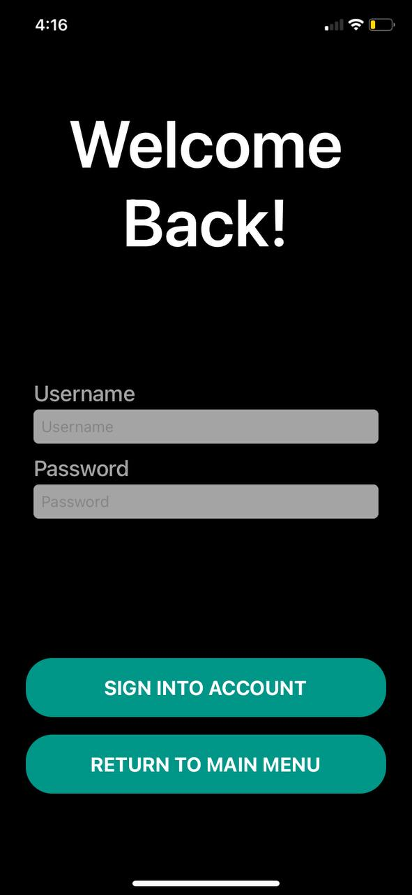

- Daily Log
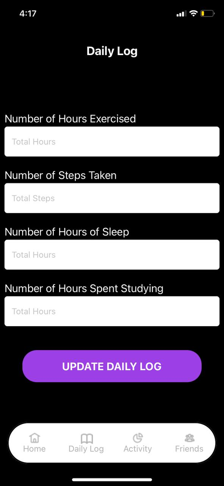

- Character Progress

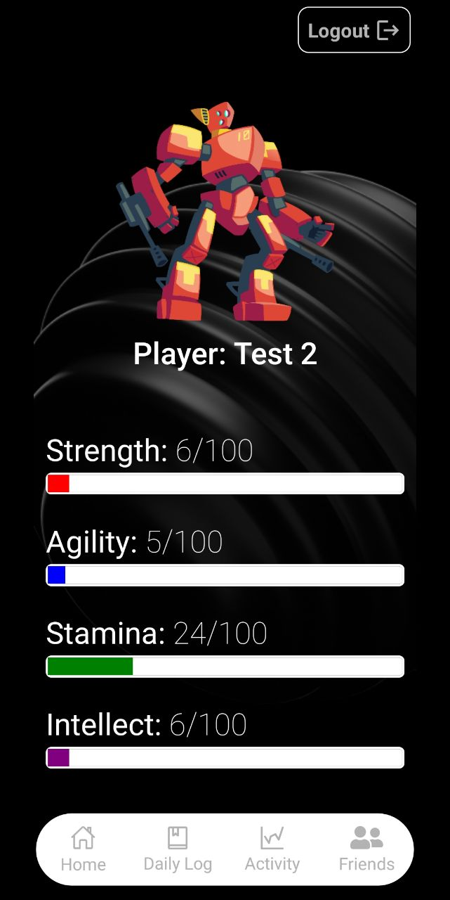

- Weekly Activity

- Friends List
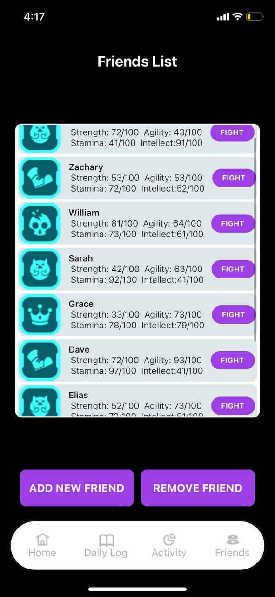

- Battle Page

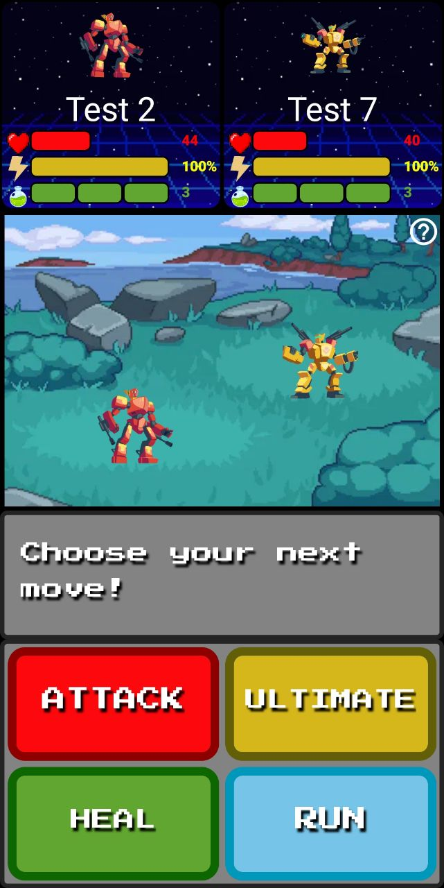
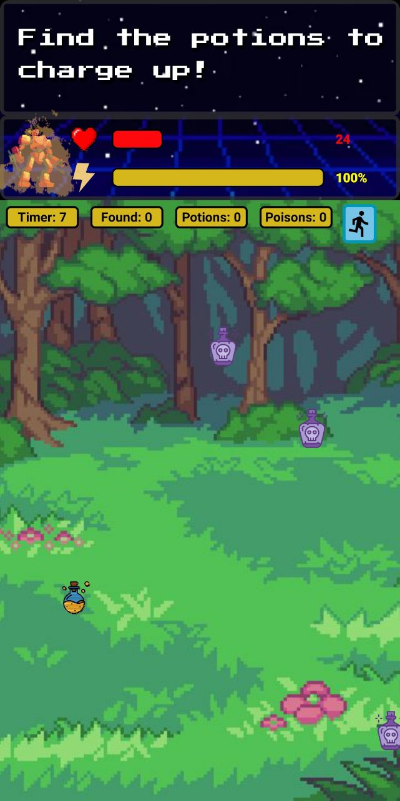

  
### 4.2 Features

An **iOS mobile app** that supports 3 main features. The user will be able to input and store data on their duration of sleep, number of steps taken, duration of exercise and the time spent studying in order to upgrade their respective stats.

**Outlined below is how the battle system will be implemented, as well as how the avatar’s character stats come into play:**

- Strength: Determines how much damage is done during each attack
- Agility: Determines the chances of dodging an attack.
- Stamina: Determines the starting health of the character where 100 is the max health for all players.
- Intellect:  Determines the maximum number of potions that can be collected in the mini game that is triggered by the ultimate move. Every yellow potion collected is equivalent to charging 2 normal attack for the next turn. Every wrong purple poison collected will result in 5 damage done to the player.
  
Implementation philosophy:
The battle system implements game logic using boolean values to track move actions and state changes. These boolean values enable move validation, enforce move limits, manage game state, and control the flow of the game. By utilising these boolean variables, the system determines the validity of moves, adjusts actions based on move limits, and ensures proper sequencing of player and enemy turns. Additionally, the system evaluates health conditions at every move to determine the outcome of the battle. Overall, the use of boolean values in the battle system enhances the gameplay experience by providing structured decision-making and result evaluation.

Secondly, users will be able to visualise how their daily habits change over time through the use of a line graph.

Lastly, the user will be able to find and add a specific player based on their player ID as a friend and challenge/battle their friends to earn medals to instil some friendly competition.

#### **4.2.1 Features implemented in Milestone 1**
a. Login to account
- New User Sign Up
  

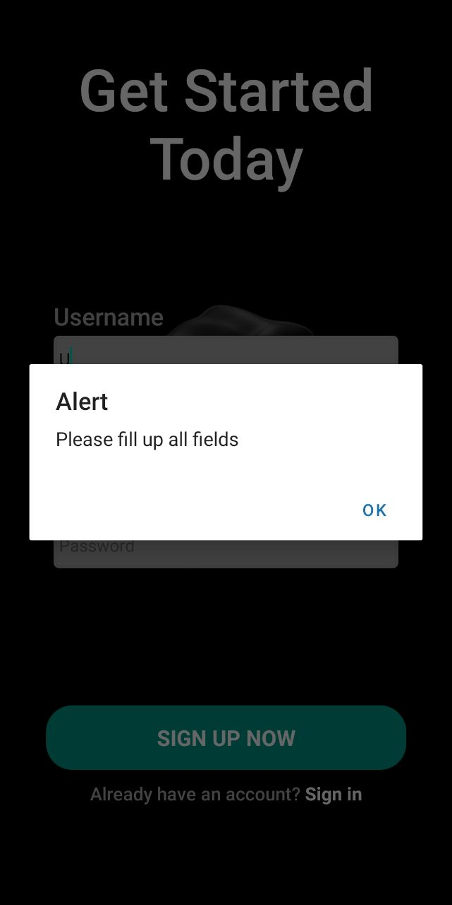

- Log in

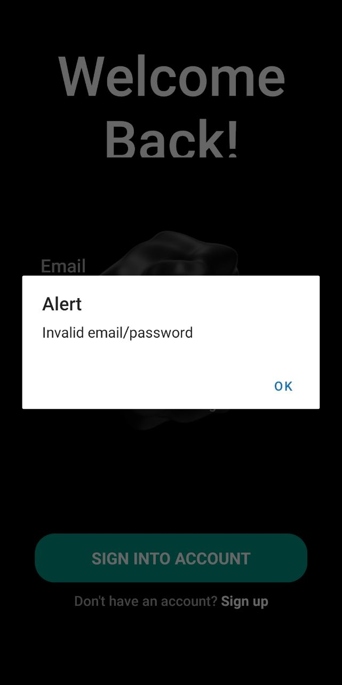

b. User Profile
- User information
  - User's data are stored in the Firebase datatbase
- Upgrading of Character
  - When the user updates their daily log, the character’s progress bars will automatically re-render and update as well
    
#### **4.2.2 Features implemented in Milestone 2**
a. Adding and removing of Friend

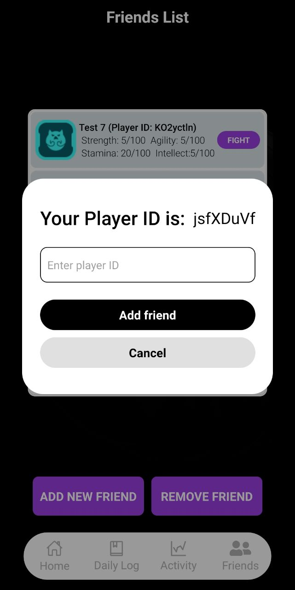

b. Player Battle System
- In the game, the player's health bar is updated based on their character's stats, and they can restore health using healing abilities limited to 3 uses per game. The player can charge their ultimate ability as long as their power bar is not depleted. To access information about how to play, they can click the info button in the top right corner of the animation window. Once the player makes a move, the game starts, and a bot randomly chooses a move in response. The damage taken and moves played are shown in a grey box below the animation window.

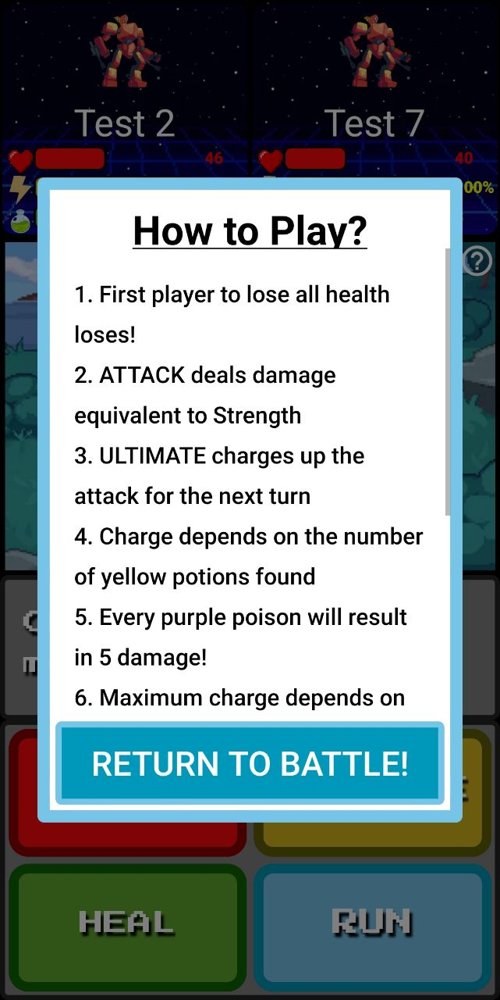

#### **4.2.3 Features implemented in Milestone 3**
a. Animation window for Player Battle System

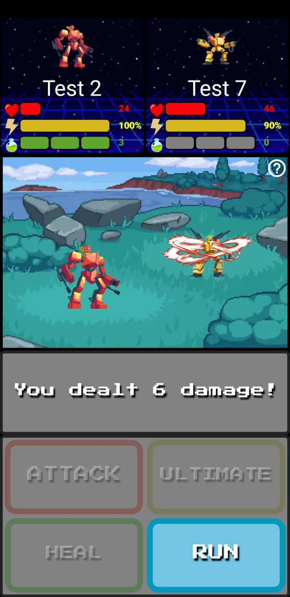
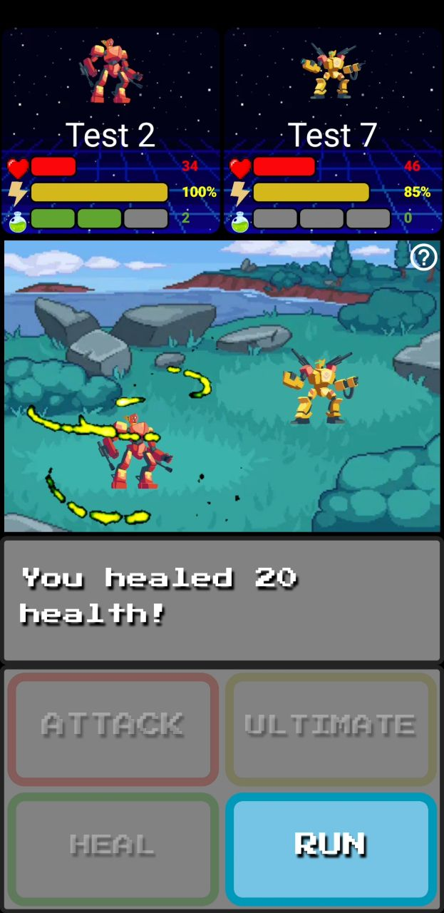
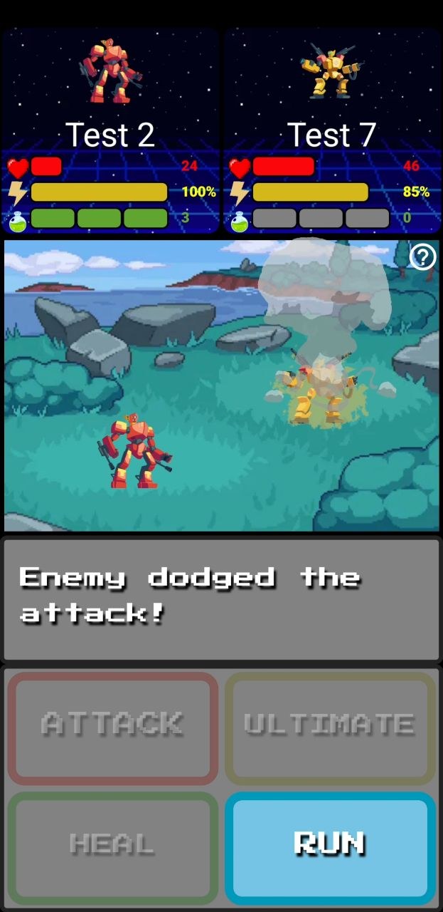

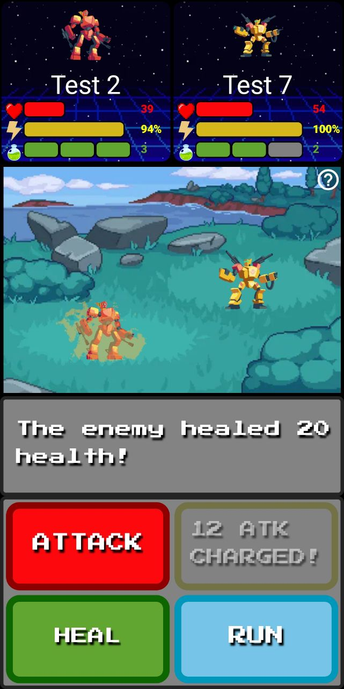
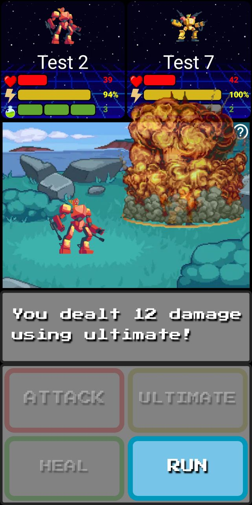

## 5. Architecture

### 5.1 Design Diagrams

### UX Flowchart

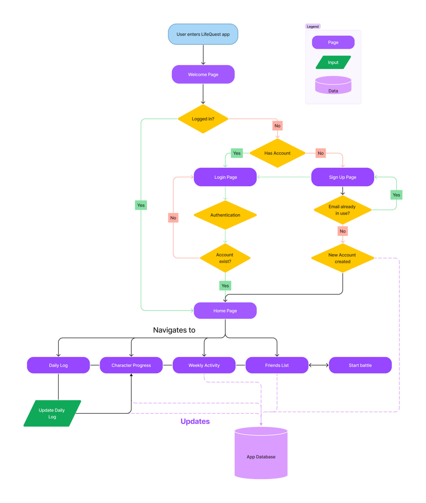

### Game Flowchart

### 5.2 Processes

**1. Tech Stack**

Frontend User Interface (Client side):

- HTML/CSS/Javascript (Languages)
- React Native

Backend (Server side):

- Firebase

Version control:

- Git & GitHub
